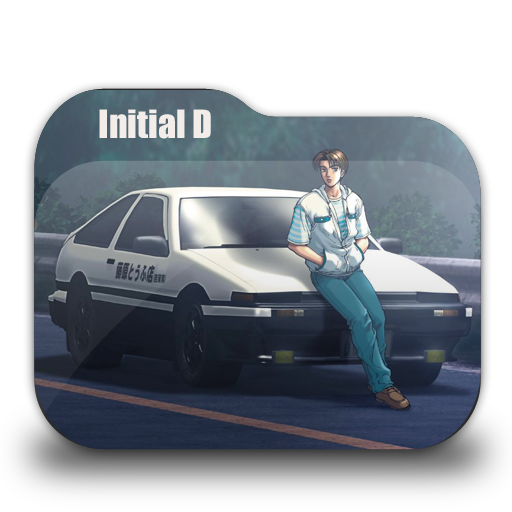

# Proyecto InitialD

Este es un proyecto web relacionado con la serie de anime "Initial D" que proporciona información sobre los equipos de carreras callejeras en la serie. Aquí encontrarás detalles sobre los equipos, sus miembros y su importancia en la trama. Además, se proporcionan enlaces a episodios de anime y otra información relacionada con la serie.

## Contenido
- [Diseño](#diseño)
- [Requisitos](#requisitos)
- [Instalación](#instalación)
- [Uso](#uso)
- [Estructura del Proyecto](#estructura-del-proyecto)
- [Licencia](#licencia)
- [Créditos](#créditos)

## Diseño

Este [Diseño](https://www.figma.com/file/ed35eSewR1ajs5KHnNBW3w/Untitled?type=whiteboard&node-id=0%3A1&t=zFrxWXgfN81bEmbK-1)
original de la página sirvió como base fundamental para el desarrollo del sitio web. 
 
## Requisitos

No se requieren requisitos especiales para acceder a este proyecto web. Puedes acceder a él a través de un navegador web estándar en cualquier dispositivo.

## Instalación

No es necesario instalar nada para utilizar este proyecto, ya que es un sitio web estático. Simplemente abre un navegador web y navega hasta la URL del proyecto o abre los archivos HTML directamente en tu computadora.

## Uso

El proyecto web se divide en varias secciones:

### Equipos de Initial D

En esta sección, encontrarás información detallada sobre los equipos de carreras callejeras de la serie "Initial D". Cada equipo tiene su propia descripción, líder y miembros destacados. Se incluyen imágenes de los equipos para una representación visual.

### Episodios de Anime

En la página de "Episodios anime", puedes ver episodios de la serie "Initial D". Se proporcionan enlaces a los episodios para que puedas disfrutar de la serie.

### Volumenes Manga (Por completar)

Esta sección está actualmente en desarrollo y contendrá información sobre los volúmenes del manga relacionados con la serie "Initial D".

## Estructura del Proyecto

- La carpeta `resources` contiene imágenes y otros recursos utilizados en el proyecto.
- Los archivos HTML (`index.html`, `equipo.html`, `episodios.html`, etc.) representan las diferentes páginas del proyecto.
- Los archivos CSS (`style.css` y `style-mobile.css`) contienen estilos para la presentación visual del proyecto.

## Licencia

Este proyecto web no tiene ninguna licencia específica y se proporciona únicamente con fines informativos y de entretenimiento.

## Créditos

Este proyecto ha sido creado por Andres Felipe Pardo Hernandez. Las imágenes y el contenido relacionado con la serie "Initial D" son propiedad de sus respectivos creadores y titulares de derechos. Siéntete libre de explorar el proyecto y disfrutar de la información sobre este emocionante anime de carreras callejeras. ¡Esperamos que te diviertas!
